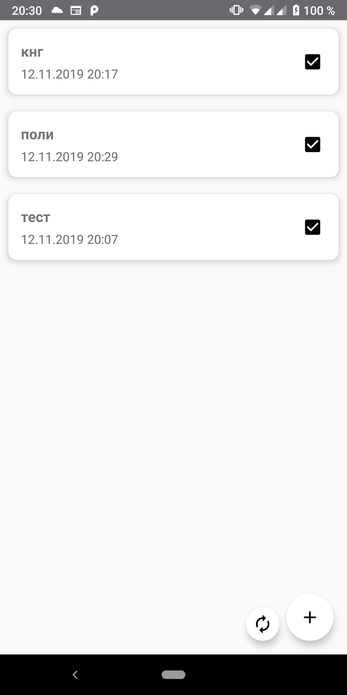

<h1>Облачное хранилище задач</h1>
<h3>Создание простейшей БД1 на устройстве. Вывод данных из таблицы БД1 на экран телефона. Редактирование данных.</h3>
<h3>Создание простейшей БД2 схожей по структуре с БД1 на удаленном сервере. Вывод данных из таблицы БД2 на экран телефона. Редактирование данных.</h3>
<h3>Создание кнопки Синхронизация, которая синхронизирует таблицы БД1 на устройстве и удаленном сервере БД2, заменяя старую запись более свежей.</h3>

